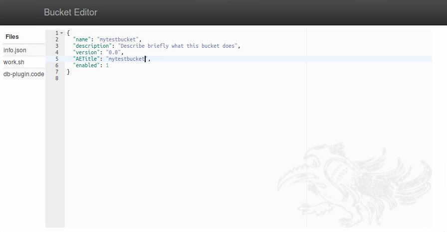

Simple web-based text editor for MagickBox bucket files
=========================================================

Editor is a stand-alone application (no installation required) used to edit files on the (bucket-) local file system.
The interface is rendered as a web-site (jquery, bootstrap, ace.js). The only files editable with this application
currently are info.json, work.sh, and db-plugin.code. Using a golang (statically-linked) executable no web-server 
like apache or nginx need to be installed inside the bucket.

This application is used as part of the MagickBox container runtime environment.

Download executable for your platform:

* Linux
   wget https://github.com/HaukeBartsch/editor/raw/master/binary/Linux64/editor
* MacOS
   wget https://github.com/HaukeBartsch/editor/raw/master/binary/MacOS/editor
* Windows
   wget https://github.com/HaukeBartsch/editor/raw/master/binary/Windows64/editor


Build instructions
--------------------

go-bindata (https://github.com/jteeuwen/go-bindata.git) is used to package the web-site code into the
golang executable. The package needs to be installed (here into /bin/go-bindata) and executed before compiling successfully. 

```
  /bin/go-bindata views/...
  go build
```

Test the application by calling:

```
  ./editor open
```
which should open a web-server that listens to port :9090 on the local machine. Connect to http://localhost:9090 from a web-browser to see the inferface.



